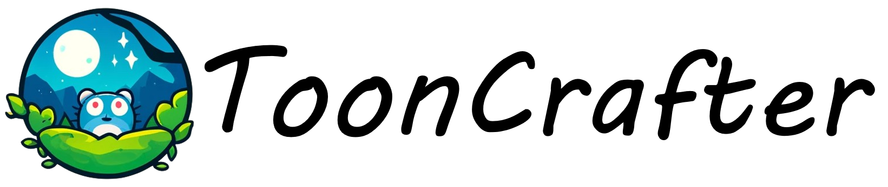

## ___***ToonCrafter: Generative Cartoon Interpolation***___
<!-- {: width="50%"} -->
<!--  -->
<div align="center">
</img>

 <a href='https://arxiv.org/abs/2405.17933'></a> &nbsp;
 <a href='https://doubiiu.github.io/projects/ToonCrafter/'></a> &nbsp;
<a href='https://www.youtube.com/watch?v=u3F35do93_8'></a><br>
<a href='https://replicate.com/fofr/tooncrafter'></a>&nbsp;&nbsp;
<a href='https://github.com/camenduru/ToonCrafter-jupyter'></a>&nbsp;
<a href='https://huggingface.co/spaces/Doubiiu/tooncrafter'></a>


_**[Jinbo Xing](https://doubiiu.github.io/), [Hanyuan Liu](https://github.com/hyliu), [Menghan Xia](https://menghanxia.github.io), [Yong Zhang](https://yzhang2016.github.io), [Xintao Wang](https://xinntao.github.io/), [Ying Shan](https://scholar.google.com/citations?hl=en&user=4oXBp9UAAAAJ&view_op=list_works&sortby=pubdate), [Tien-Tsin Wong](https://ttwong12.github.io/myself.html)**_
<br><br>
From CUHK and Tencent AI Lab.

<strong>at SIGGRAPH Asia 2024, Journal Track</strong>


</div>
 
## 🔆 Introduction

⚠️ We have not set up any official profit-making projects or web applications. Please be cautious!!!

🤗 ToonCrafter can interpolate two cartoon images by leveraging the pre-trained image-to-video diffusion priors. Please check our project page and paper for more information. <br>


### 1.1 Showcases (512x320)
<table class="center">
    <tr style="font-weight: bolder;text-align:center;">
        <td>Input starting frame</td>
        <td>Input ending frame</td>
        <td>Generated video</td>
    </tr>
  <tr>
  <td>
    
  </td>
  <td>
    
  </td>
  <td>
    
  </td>
  </tr>


   <tr>
  <td>
    
  </td>
  <td>
    
  </td>
  <td>
    
  </td>
  </tr>
  <tr>
  <td>
    
  </td>
  <td>
    
  </td>
  <td>
    
  </td>
  </tr> 
  <tr>
  <td>
    
  </td>
  <td>
    
  </td>
  <td>
    
  </td>
  </tr>
</table>

### 1.2 Sparse sketch guidance
<table class="center">
    <tr style="font-weight: bolder;text-align:center;">
        <td>Input starting frame</td>
        <td>Input ending frame</td>
        <td>Input sketch guidance</td>
        <td>Generated video</td>
    </tr>
  <tr>
  <td>
    
  </td>
  <td>
    
  </td>
  <td>
    
  </td>
   <td>
    
  </td>
  </tr>

  <tr>
  <td>
    
  </td>
  <td>
    
  </td>
  <td>
    
  </td>
   <td>
    
  </td>
  </tr>


</table>


### 2. Applications
#### 2.1 Cartoon Sketch Interpolation (see project page for more details)
<table class="center">
    <tr style="font-weight: bolder;text-align:center;">
        <td>Input starting frame</td>
        <td>Input ending frame</td>
        <td>Generated video</td>
    </tr>

  <tr>
  <td>
    
  </td>
  <td>
    
  </td>
  <td>
    
  </td>
  </tr>


   <tr>
  <td>
    
  </td>
  <td>
    
  </td>
  <td>
    
  </td>
  </tr>

</table>


#### 2.2 Reference-based Sketch Colorization
<table class="center">
    <tr style="font-weight: bolder;text-align:center;">
        <td>Input sketch</td>
        <td>Input reference</td>
        <td>Colorization results</td>
    </tr>
    
  <tr>
  <td>
    
  </td>
  <td>
    
  </td>
  <td>
    
  </td>
  </tr>


   <tr>
  <td>
    
  </td>
  <td>
    
  </td>
  <td>
    
  </td>
  </tr>

</table>


## 📝 Changelog
- [ ] Add sketch control and colorization function.
- __[2024.05.29]__: 🔥🔥 Release code and model weights.
- __[2024.05.28]__: Launch the project page and update the arXiv preprint.
<br>


## 🧰 Models

|Model|Resolution|GPU Mem. & Inference Time (A100, ddim 50steps)|Checkpoint|
|:---------|:---------|:--------|:--------|
|ToonCrafter_512|320x512| ~24G & 24s (`perframe_ae=True`)|[Hugging Face](https://huggingface.co/Doubiiu/ToonCrafter/blob/main/model.ckpt)|

We get the feedback from issues that the model may consume about 24G~27G GPU memory in this implementation, but the community has lowered the consumption to ~10GB.

Currently, our ToonCrafter can support generating videos of up to 16 frames with a resolution of 512x320. The inference time can be reduced by using fewer DDIM steps.


## ⚙️ Setup

### Install Environment via Anaconda (Recommended)
```bash
conda create -n tooncrafter python=3.8.5
conda activate tooncrafter
pip install -r requirements.txt
```


## 💫 Inference
### 1. Command line

Download pretrained ToonCrafter_512 and put the `model.ckpt` in `checkpoints/tooncrafter_512_interp_v1/model.ckpt`.
```bash
  sh scripts/run.sh
```


### 2. Local Gradio demo

Download the pretrained model and put it in the corresponding directory according to the previous guidelines.
```bash
  python gradio_app.py 
```


## 🤝 Community Support
1. ComfyUI and pruned models (fp16): [ComfyUI-DynamiCrafterWrapper](https://github.com/kijai/ComfyUI-DynamiCrafterWrapper) (Thanks to [kijai](https://twitter.com/kijaidesign))

|Model|Resolution|GPU Mem. |Checkpoint|
|:---------|:---------|:--------|:--------|
|ToonCrafter|512x320|12GB |[Hugging Face](https://huggingface.co/Kijai/DynamiCrafter_pruned/blob/main/tooncrafter_512_interp-fp16.safetensors)|

2. ComfyUI. [ComfyUI-ToonCrafter](https://github.com/AIGODLIKE/ComfyUI-ToonCrafter) (Thanks to [Yorha4D](https://github.com/Yorha4D))

3. Colab. [Code](https://github.com/camenduru/ToonCrafter-jupyter) (Thanks to [camenduru](https://github.com/camenduru)), [Code](https://gist.github.com/0smboy/baef995b8f5974f19ac114ec20ac37d5) (Thanks to [0smboy](https://github.com/0smboy))

4. Windows platform support: [ToonCrafter-for-windows](https://github.com/sdbds/ToonCrafter-for-windows) (Thanks to [sdbds](https://github.com/sdbds))

5. Sketch-guidance implementation: [ToonCrafter_with_SketchGuidance](https://github.com/mattyamonaca/ToonCrafter_with_SketchGuidance) (Thanks to [mattyamonaca](https://github.com/mattyamonaca))

## 😉 Citation
Please consider citing our paper if our code is useful:
```bib
@article{xing2024tooncrafter,
  title={Tooncrafter: Generative cartoon interpolation},
  author={Xing, Jinbo and Liu, Hanyuan and Xia, Menghan and Zhang, Yong and Wang, Xintao and Shan, Ying and Wong, Tien-Tsin},
  journal={ACM Transactions on Graphics (TOG)},
  volume={43},
  number={6},
  pages={1--11},
  year={2024}
}
```


## 🙏 Acknowledgements
We would like to thank [Xiaoyu](https://engineering.purdue.edu/people/xiaoyu.xiang.1) for providing the [sketch extractor](https://github.com/Mukosame/Anime2Sketch), and [supraxylon](https://github.com/supraxylon) for the Windows batch script.

<a name="disc"></a>
## 📢 Disclaimer
Calm down. Our framework opens up the era of generative cartoon interpolation, but due to the variaity of generative video prior, the success rate is not guaranteed.

⚠️This is an open-source research exploration, instead of commercial products. It can't meet all your expectations.

This project strives to impact the domain of AI-driven video generation positively. Users are granted the freedom to create videos using this tool, but they are expected to comply with local laws and utilize it responsibly. The developers do not assume any responsibility for potential misuse by users.
****
